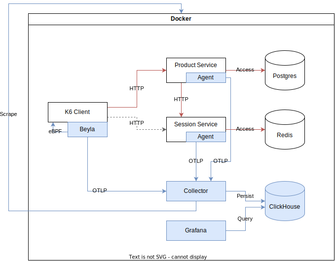

# otel-shopping-cart-benchmark

- Grafana: http://localhost:3000


## Building the images

```bash
docker compose -f compose.observability.yaml -f compose.services.yaml -f compose.load.yaml -f compose.session.java.yaml pull
docker compose -f compose.observability.yaml -f compose.services.yaml -f compose.load.yaml -f compose.session.java.yaml build

docker compose -f compose.observability.yaml -f compose.services.yaml -f compose.load.yaml -f compose.session.ts.yaml pull
docker compose -f compose.observability.yaml -f compose.services.yaml -f compose.load.yaml -f compose.session.ts.yaml build
```

## Steps

Setup observability stack, also used for container monitoring:

```bash
docker compose -f compose.observability.yaml up -d
docker compose -f compose.observability.yaml -f compose.services.yaml up -d redis postgres
```

Set up the applications [Java & Java]:

```bash
docker compose -f compose.observability.yaml -f compose.services.yaml -f compose.session.java.yaml up -d product-service session-service --build
```

Set up the applications [Java & TypeScript]:

```bash
docker compose -f compose.observability.yaml -f compose.services.yaml -f compose.session.ts.yaml up -d product-service session-service --build
```

Run the benchmark:

```bash
docker compose -f compose.observability.yaml -f compose.services.yaml -f compose.load.yaml up -d k6 autoinstrumenter
```

## Restart / Change settings

Edit the `compose.services.yaml` file and (un)comment the `JAVA_TOOL_OPTIONS` and `NODE_OPTIONS` for *ALL* services.

Restart the services:

```bash
docker compose -f compose.services.yaml stop redis postgres product-service
docker compose -f compose.services.yaml -f compose.session.java.yaml stop session-service
docker compose -f compose.services.yaml -f compose.session.ts.yaml stop session-service
docker compose -f compose.services.yaml down -v redis postgres
```

## Remove and purge all

```bash
docker compose -f compose.observability.yaml -f compose.services.yaml -f compose.load.yaml -f compose.session.java.yaml down -v
docker compose -f compose.observability.yaml -f compose.services.yaml -f compose.load.yaml -f compose.session.ts.yaml down -v
```
